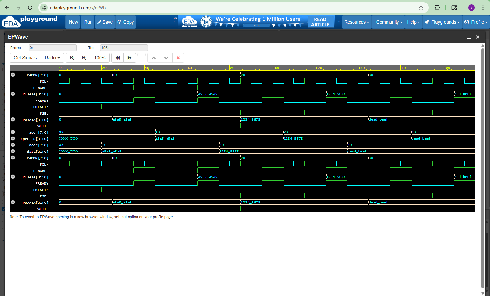

# APB Slave Design & Verification

## Overview
This project implements and verifies an APB (Advanced Peripheral Bus) slave using SystemVerilog.

APB is a simple bus protocol used for connecting low-bandwidth peripherals in SoC designs.

## Features
- APB write transaction
- APB read transaction
- Address-based memory access
- PREADY response signal
- PASS/FAIL read validation
- Waveform-based protocol debugging

## Design (RTL)
The APB slave contains a small memory array. During write transactions, data from PWDATA is stored into memory using PADDR. During read transactions, memory data is returned on PRDATA.

## APB Signals
- PCLK: Clock
- PRESETn: Active-low reset
- PSEL: Peripheral select
- PENABLE: Enable phase
- PWRITE: Write/read control
- PADDR: Address bus
- PWDATA: Write data bus
- PRDATA: Read data bus
- PREADY: Slave ready response

## Verification
A SystemVerilog testbench is used to:
- Generate APB write transactions
- Generate APB read transactions
- Compare expected and actual read data
- Validate APB handshake behavior
- Generate waveform output

## Tools Used
- SystemVerilog
- EDA Playground
- Icarus Verilog
- EPWave

## Waveform

## Simulation Output
WRITE: Address=16 Data=a5a5a5a5 PASS READ: Address=16 Data=a5a5a5a5  
WRITE: Address=32 Data=12345678 PASS READ: Address=32 Data=12345678  
WRITE: Address=48 Data=deadbeef PASS READ: Address=48 Data=deadbeef  
APB verification completed.

## Skills Demonstrated
- RTL Design using SystemVerilog
- APB Protocol Implementation & Understanding
- Functional Verification of Read/Write Transactions
- Testbench Development and Simulation
- Debugging using Waveform Analysis (EPWave)

## APB Protocol Phases
- Setup Phase: PSEL = 1, PENABLE = 0  
- Enable Phase: PSEL = 1, PENABLE = 1  
- Transfer completes when PREADY = 1  

## Author
Subba Raju Sarikonda

